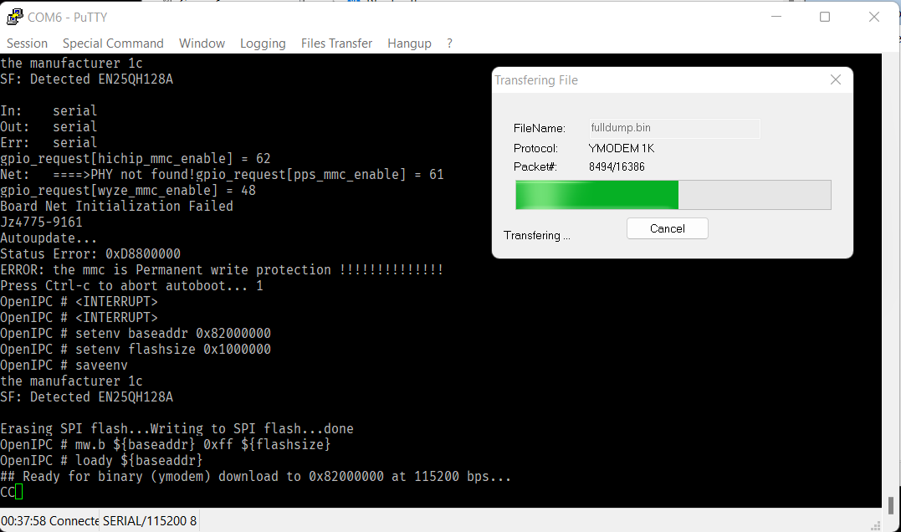
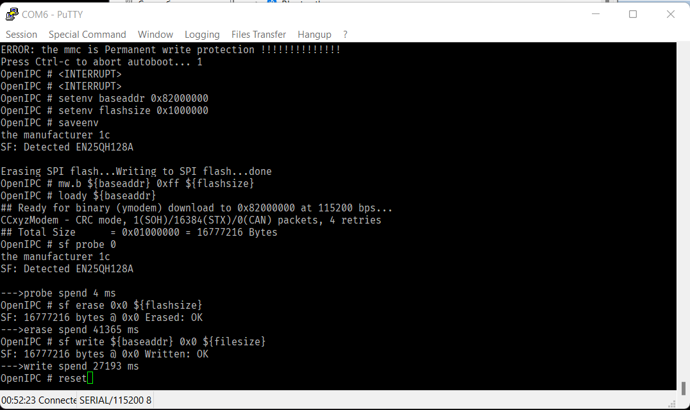
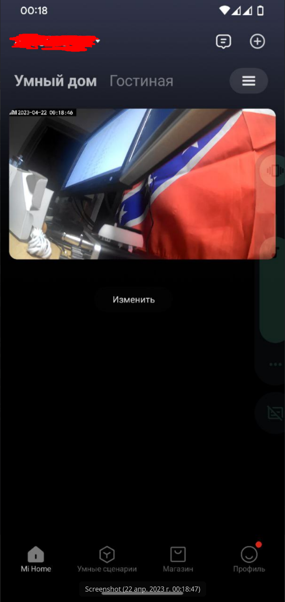

# Откат на заводскую прошивку Xiaomi MJSXJ03HL через UART ymodem (Windows)

_________
Это дополнение к оригинальному [мануалу](https://github.com/OpenIPC/device-mjsxj03hl/blob/master/README_ru.md). Там описаны все подготовительные действия, такие как разборка камеры, подключение камеры по UART, создание резервной копии. Обязательно их выполните.

***Обязательно выполните резервное копирование оригинальной прошивки по [инструкции](https://github.com/OpenIPC/device-mjsxj03hl/blob/master/README_ru.md#%D1%81%D0%BE%D1%85%D1%80%D0%B0%D0%BD%D0%B5%D0%BD%D0%B8%D0%B5-%D0%B7%D0%B0%D0%B2%D0%BE%D0%B4%D1%81%D0%BA%D0%BE%D0%B9-%D0%BF%D1%80%D0%BE%D1%88%D0%B8%D0%B2%D0%BA%D0%B8)***

Я же покажу, как восстановить стоковую прошивку MI Camera 2K загрузкой бэкапа через UART

***Внимание! Любые вносимые изменения лишают вас гарантии на данное устройство! Ответственность за любой ущерб, возникший в результате любых действий пользователя, автор не несет!
На моей камере размер флеша 16Мб, все команды из мануала подходят для неё.***
_________
## Необходимые инструменты:

Для работы под ОС Windows вам необходимы следующие инструменты:

- [ExtraPuTTY](https://sourceforge.net/projects/extraputty/files/) - модифицированное приложение терминала с возможностью передачи файлов

_________
## Восстановление стоковой прошивки MI Camera 2K загрузкой бэкапа через UART

Для этого вам понадобится бэкап оригинальной прошивки вашей камеры, созданный перед прошивкой OpenIPC по инструкции из оригинального мануала. Вы же его сделали и сохранили. Так ведь?

Подключитесь через UART к камере и прервите загрузку камеры комбинацией клавиш CTRL+C.

***Важно: В оригинальном мануале используется значение baseaddr 0x80600000, в моем случае на MJSXJ03HL с использованием последних версий ПО и прошивок прошивка заработала лишь с baseaddr 0x82000000, со значениями из оригинального мануала камера перешла в режим восстановления Cloner и вам придётся снова её прошивать по инструкции выше (хотя бы uboot). Но, так как Cloner позволяет снова прошить uboot, можете попробовать***

Введите переменные окружения и сохраните их:

    setenv baseaddr 0x82000000
    setenv flashsize 0x1000000
    saveenv

Очистите память:

    mw.b ${baseaddr} 0xff ${flashsize}

Выполните команду приёма файла:

    loady ${baseaddr}

В меню ExtraPutty выберите Files Transfer -> Ymodem -> Send и выберите файл образа оригинальной прошивки. Теперь пейте чай и ожидайте завершения загрузки.

По завершению загрузки файла очистите флеш камеры, прошейте сток и перезагрузите камеру. Выполните команды:

    sf probe 0
    sf erase 0x0 ${flashsize}
    sf write ${baseaddr} 0x0 ${filesize}

Стоковая прошивка вернулась на камеру, и её снова можно подключать в приложение Mi Home.

_________
## Использованные материалы

- [OpenIPC for Xiaomi MJSXJ03HL](https://github.com/OpenIPC/device-mjsxj03hl)
- [OpenIPC Wiki](https://github.com/OpenIPC/wiki)
- Помощь товарищей из Телеграм канала [OpenIPC users (RU)](https://t.me/openipc_modding)
