## Установка OnepIPC на Xiaomi MJSXJ03HL через Cloner (Windows)

### Внимание ! Многие пункты инструкции уже устарели и требуют актуализации

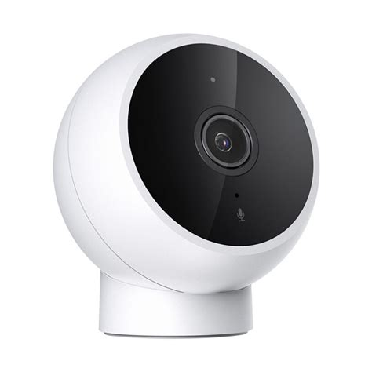
_________
Это дополнение к оригинальному [мануалу](https://github.com/OpenIPC/device-mjsxj03hl/blob/master/README_ru.md). Там описаны все подготовительные действия, такие как разборка камеры, подключение камеры по UART, создание резервной копии. Обязательно их выполните.

Я же покажу, как установить OnenIPC для Xiaomi  MI Camera 2K (mjsxj03hl) одной кнопкой через Cloner в ОС Windows

***Обязательно выполните резервное копирование оригинальной прошивки по [инструкции](https://github.com/OpenIPC/device-mjsxj03hl/blob/master/README_ru.md#%D1%81%D0%BE%D1%85%D1%80%D0%B0%D0%BD%D0%B5%D0%BD%D0%B8%D0%B5-%D0%B7%D0%B0%D0%B2%D0%BE%D0%B4%D1%81%D0%BA%D0%BE%D0%B9-%D0%BF%D1%80%D0%BE%D1%88%D0%B8%D0%B2%D0%BA%D0%B8)***

***Внимание! Любые вносимые изменения лишают вас гарантии на данное устройство! Ответственность за любой ущерб, возникший в результате любых действий пользователя, автор не несет!***
_____
## Необходимые инструменты:

Для работы под ОС Windows вам необходимы следующие инструменты:

- [ExtraPuTTY](https://sourceforge.net/projects/extraputty/files/) - модифицированное приложение терминала с возможностью передачи файлов

- [Cloner](ftp://ftp.ingenic.com.cn/DevSupport/Tools/USBBurner)  Последняя версия в архиве для Windows. Ссылка FTP: ftp://ftp.ingenic.com.cn/DevSupport/Tools/USBBurner

- Data кабель USB type-c (с поддержкой передачи файлов)

Так как скорость скачивания с ftp ingenic ещё медленнее, чем передача файла по UART, дублирую необходимый софт на [Yandex Disk](https://disk.yandex.ru/d/BJ-_Lq1zE5DeZw)
_________
### Готовимся к прошивке и затираем бут (ломаем камеру)

Скачайте загрузчик [U-Boot](https://github.com/OpenIPC/firmware/releases/tag/latest) для вашего процессора камеры и распакуйте прошивку из [билдера](https://github.com/OpenIPC/builder/releases/tag/latest) для вашей модели камеры и Cloner в пустой каталог

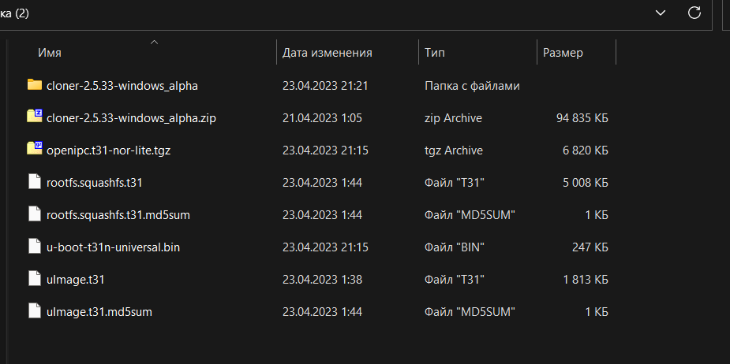

Установите драйвер из архива Cloner. Для этого перейдите в подкаталог с драйвером, нажмите на файл usb_cloner_device.inf правой кнопкой мыши и из контектсного меню выбирите "Установить".

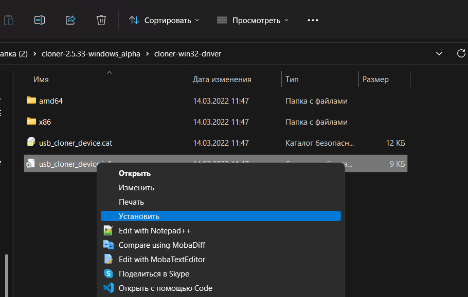

Подключите камеру по UART, подключитесь к ней через Putty, тип соединения Serial, ваш номер COM порта и скорость 115200.

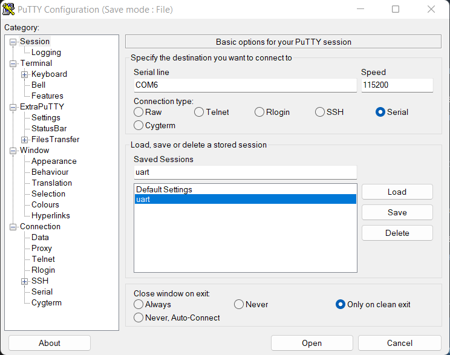

После этого подключитесь к камере и прервите загрузку методом замыкания контактов из [оригинальной статьи](https://github.com/OpenIPC/wiki/blob/master/en/help-uboot.md#shorting-pins-on-flash-chip). Вы попадётё в меню оригинального Uboot и теперь нужно затереть родной загрузчик на камере. Введите команды

    sf probe 0
    sf erase 0x0 0x50000
    reset

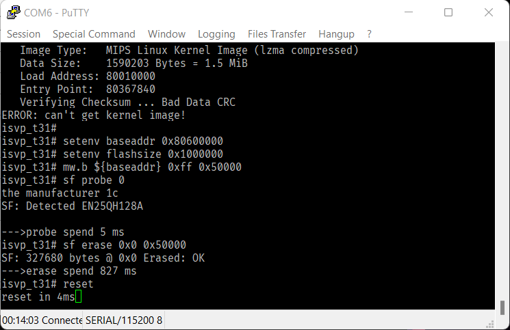

После этих действий камера терминал Putty перестанет отвечать на ваши команды. Переподключите кабель USB к компьютеру и в диспетчере устройств появится новое устройство. Это и есть интерфейс восстановления для вашей камеры. Если устройство не появилось - убедитесь, что ваш USB кабель поддерживает передачу данных, либо что вы установили драйвер Cloner.

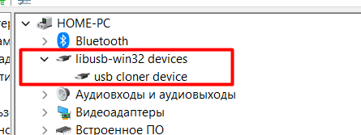

Убедитесь, что устройство появилось в списке и отключите кабель USB от компьютера.
_________
### Настройка Cloner для нашей камеры и прошивка OpenIPC

Из каталога, куда вы распаковали Cloner запустите cloner.exe

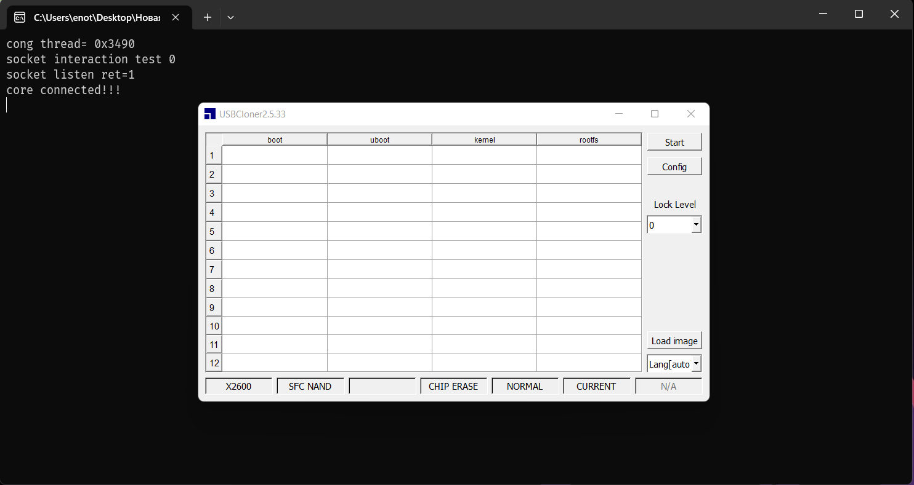

Нажмите кнопку Config и на вкладке Info выставьте настройки блока Config как на скриншоте (Platform: T/t31, Board: t32nl_sfc_nor_ddr2_linux.cfg)

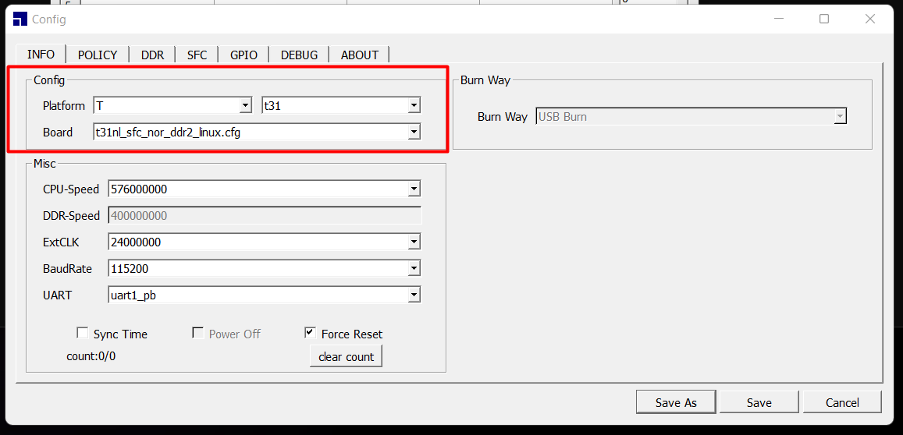

На вкладке Policy установите всее 3 галочки, в каждой строке пропишите соответствующий offset (как в оригинальном мануале и на скриншоте) и по кнопке setting загрузите соответствующие компоненты прошивки. Если кнопка setting не видна - растяните окно вправо :)

*HtFix* Используйте значение 250000 вместо 350000 на картинке ниже

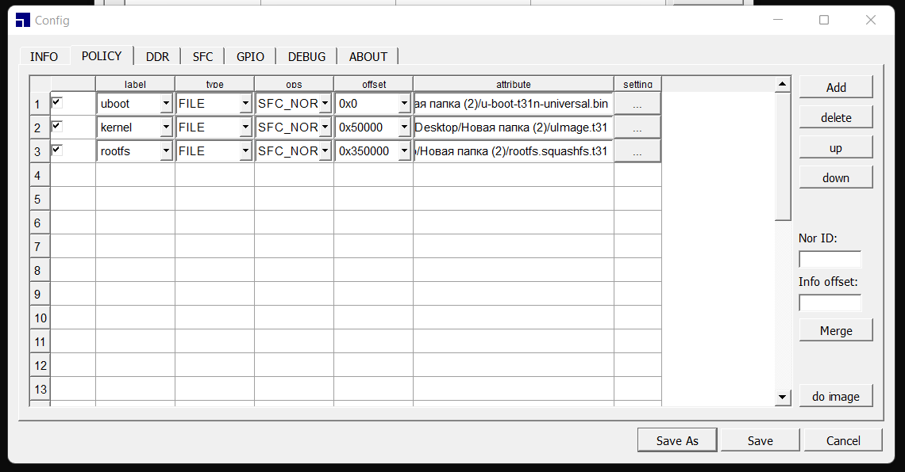

Нажмите кнопку Save, подтвердите сохранение конфига, нажмите в главном окне кнопку Start и подключите кабель USB от камеры к компьютеру. Когда появится новое устройство, Cloner начнёт заливать прошивку.

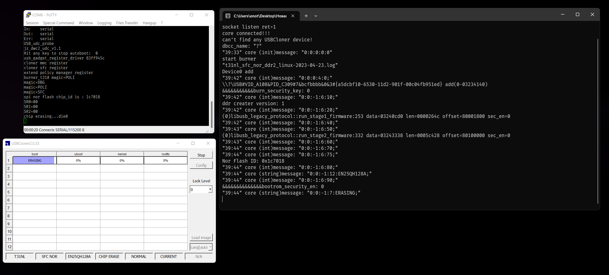

Так выглядит успешное завершение процесса:

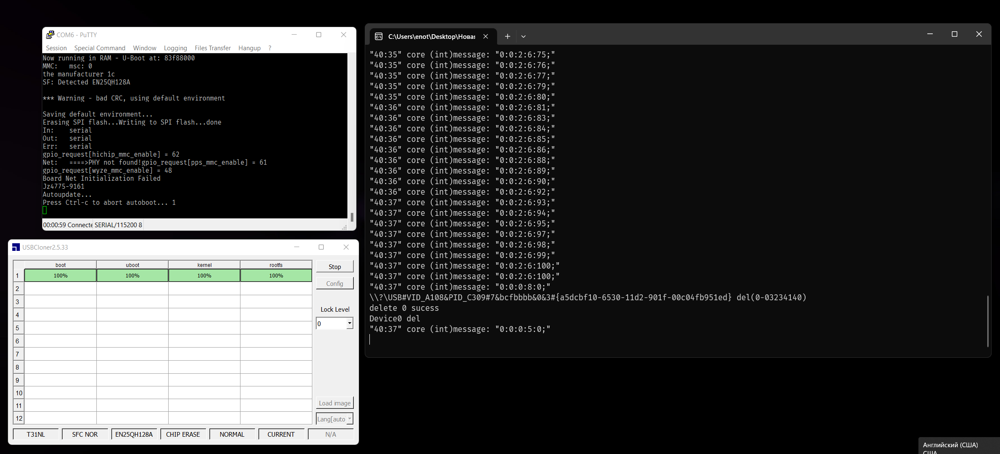

Далее логинитесь в root, вводите команду firstboot и проводите настройку согласно оригинальному мануалу. 

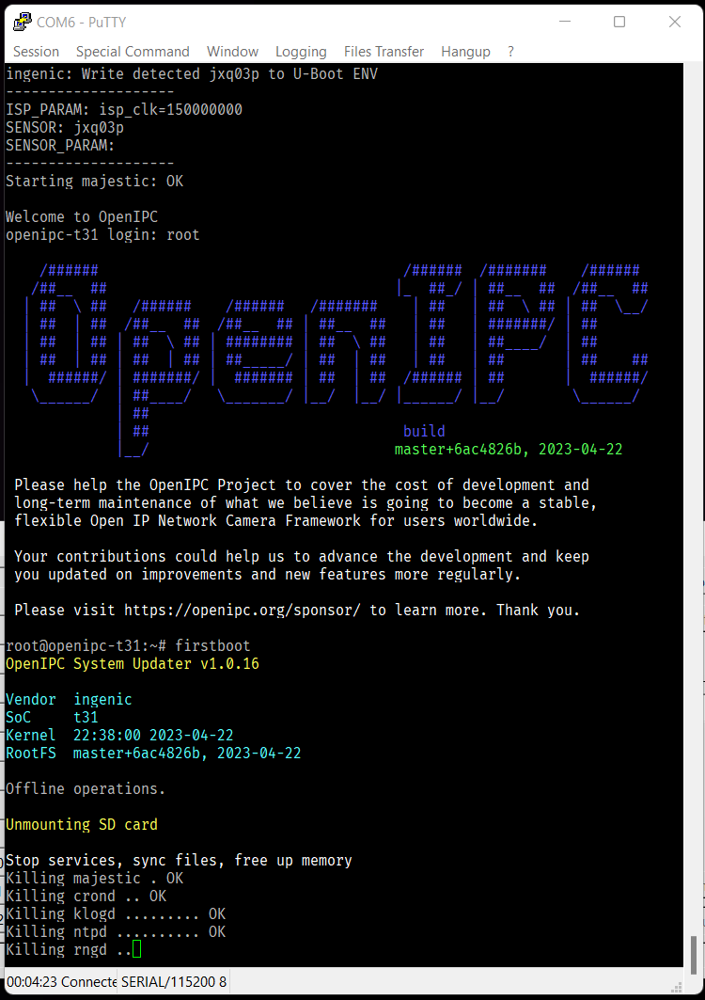

_________
### Используемые материалы

- [OpenIPC for Xiaomi MJSXJ03HL](https://github.com/OpenIPC/device-mjsxj03hl)
- [OpenIPC Wiki](https://github.com/OpenIPC/wiki)
- Помощь товарищей из Телеграм канала [OpenIPC users (RU)](https://t.me/openipc_modding)
